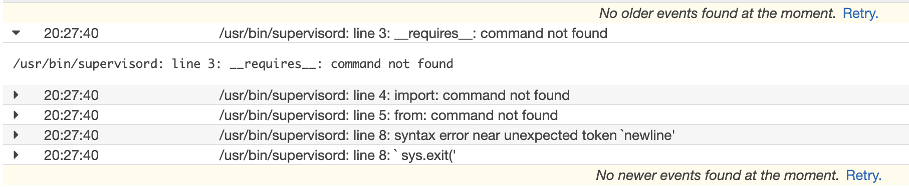

# expert-pancake

Welcome to my wordpress Fargate Cluster code.
This cluster is built by ansible, packer and terraform.
Ansible creates the wordpress docker images.
Packer runs the ansible playbook and uploads the image to ECR
Terraform creates all the infrastructure.

# Build Steps

### Prerequisites
Have ansible, packer and terraform installed.
Have an account in the expert-pancake AWS account

### Steps
- 1: First tun the terraform to create the infrastructure.
This terraform relies on a profile called `expert-pancake` being present in your local `~/.aws/credentials`file.
Once you are sure that is present run `terraform init` and `terraform apply`

- 2: Then run packer
From the root of the repo run `packer build packer/wordpress.json`

- 3: wait

# Questions
 * What you have done ?

 I have created the infrastructure and automation to build and run a Wordpress Container on AWS Fargate.
 Terraform -
  Code for ECS, SGs, IAM, ALB, RDS
 Ansible -
  Code to create a docker image for Wordpres
 Packer -
  Code to run the Ansible code and then deploy the created image to AWS ECR

 * How did you run your project ?

 The project runs on AWS Fargate

 * What are the components interacting with each other ?

 AWS fargate is running a docker container on a AWS hosted server
 AWS ECR is hosting the image that fargate pulls
 An AWS ALB allows us to route requests to a running instance
 Security Groups allow users to reach the ALB and alse for the ALB to reach the Container

 The container is running nginx, wordpress and php-fpm

 * What problems did you encounter ?

 Only real problems I faced were getting all the different software installed and running on the
 container.
 I spent far to long being silly and pulling centos:latest and not realising there is centos:8 now and everything I was installing was for centos:7 :man_facepalming:
 I also never got supervisord to run properly at container start-up (see logs below)

 * How would you have done things to have the best HA/automated architecture?

 Using Fargate meant I got a lot HA out of the box.
 To have improved it I would have ran more instances of the container in different subnets of the vpc
 I also would have look into making the RDS cluster have more instances in different subnets.

 In terms of automation I would like to play around with having a terraform null_resource run the `packer build packer/wordpress.json` command. This way it would take two commands to deploy and build the entire stack.

 * Share with us any ideas you have in mind to improve this kind of infrastructure.

 This is a pretty industry standard way of deploying a LEMP stack.

 Aside from obvious security holes I will talk about later I think this is very strong infrastructure.
 I often find simple is best.

 * Tomorrow we want to put this project in production. What would be your advice and choices to achieve that ?

  **Security**
  I cut a lot of corners when writing this code!
  - There is no TLS/SSL networking
    - User -> ALB
    - ALB -> container
    - container -> DB
  - I used the default VPC
    - Default VPC should never be used
    - VPC should have 3 levels of subnet public, private and private-db
    - ALB should be public, container private and RDS private-db
  - Due to bad VPC setup the container is public
  - Hardcoded unencrypted passwords in the terraform
    - These should have been stored in AWS secrets Manager or Vault and pulled at runtime.

  All of the above points and probably some more would need fixing first

  **packages**
- There is no SHA check on the packages being installed
- most packages are pinned to latest
These points would need rectifying

  **monitoring**
- Logs will be nicely captured by Cloudwatch
- Alerts should be set up to monitor the state of the cluster
I find lately AWS has great tools for this Log insights are really good, but of course if using an external tools all metrics and logs should be forwarded on.

  **Routing**
Kinda falls under TLS/SSL but I never set up a domain for the webapp to run under and route to the ALB
- Route53 ties in very nicely for this

  **WAF/Protection**
I would like to set up an AWS WAF set up to protect against the most common OWASP attacks etc.

# End Result

In the end I never did see my Wordpress application :disappointed:

But I know all the terraform, ansible and packer worked as expected.
You can see below that the container comes up and then supervisord fails

Reading online I reckon this is to do with me having a hodge podge of package versions installed or me missing something simple like python.

In practice I would probably make my own Centos images with all the needed libraries installed and then pull this and install nginx etc. ontop

Thanks for reading,
Connal
